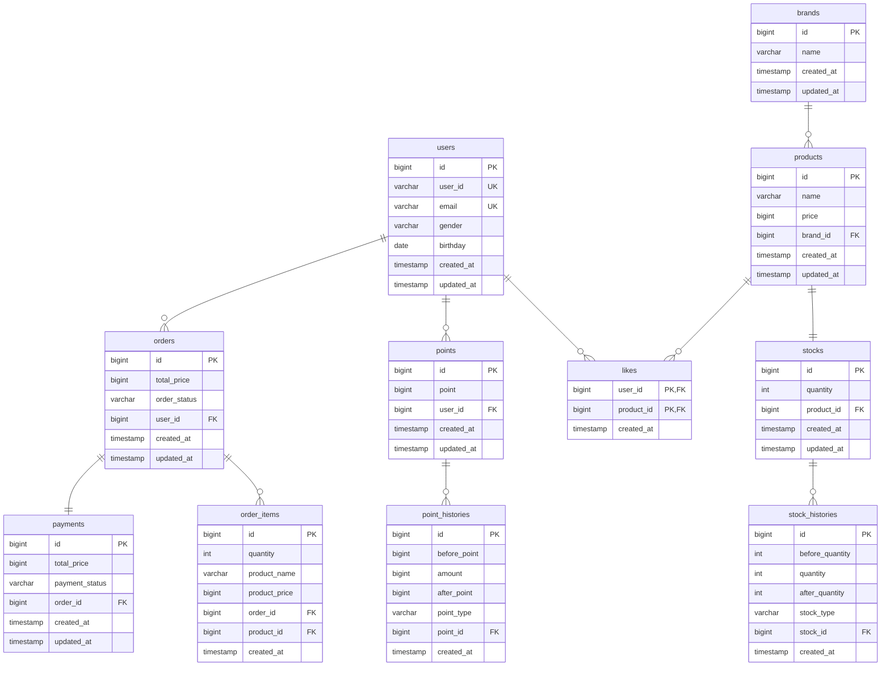

```mermaid
erDiagram
    users {
        bigint id PK
        varchar user_id UK
        varchar email UK
        varchar gender
        date birthday
        timestamp created_at
        timestamp updated_at
    }
    products {
        bigint id PK
        varchar name
        bigint price
        bigint brand_id FK
        timestamp created_at
        timestamp updated_at
    }
    stocks {
        bigint id PK
        int quantity
        bigint product_id FK
        timestamp created_at
        timestamp updated_at
    }
    stock_histories {
        bigint id PK
        int before_quantity
        int quantity
        int after_quantity
        varchar stock_type
        bigint stock_id FK
        timestamp created_at
    }
    brands {
        bigint id PK
        varchar name
        timestamp created_at
        timestamp updated_at
    }
    likes {
        bigint user_id PK, FK
        bigint product_id PK, FK
        timestamp created_at
    }
    points {
        bigint id PK
        bigint point
        bigint user_id FK
        timestamp created_at
        timestamp updated_at
    }
    point_histories {
        bigint id PK
        bigint before_point
        bigint amount
        bigint after_point
        varchar point_type
        bigint point_id FK
        timestamp created_at
    }
    orders {
        bigint id PK
        bigint total_price
        varchar order_status
        bigint user_id FK
        timestamp created_at
        timestamp updated_at
    }
    order_items {
        bigint id PK
        int quantity
        varchar product_name
        bigint product_price
        bigint order_id FK
        bigint product_id FK
        timestamp created_at
    }
    payments {
        bigint id PK
        bigint total_price
        varchar payment_status
        bigint order_id FK
        timestamp created_at
        timestamp updated_at
    }
    users ||--o{ likes: ""
    users ||--o{ points: ""
    users ||--o{ orders: ""
    brands ||--o{ products: ""
    products ||--|| stocks: ""
    stocks ||--o{ stock_histories: ""
    points ||--o{ point_histories: ""
    orders ||--o{ order_items: ""
    orders ||--|| payments: ""
    products ||--o{ likes: ""
```